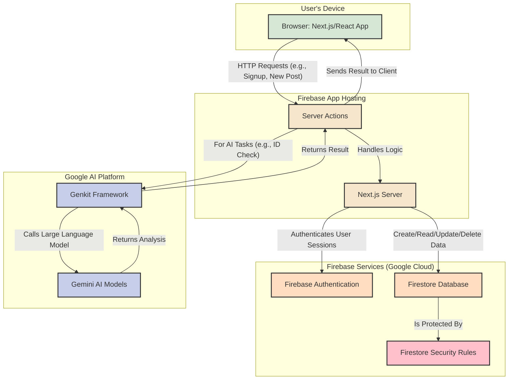

# Firebase Studio

This is a NextJS starter in Firebase Studio.

To get started, take a look at src/app/page.tsx.

## Application Architecture

Below is a diagram illustrating the architecture of the CampusFind application. It shows how the different services and components interact with each other.

Click to view Architecture Diagram

